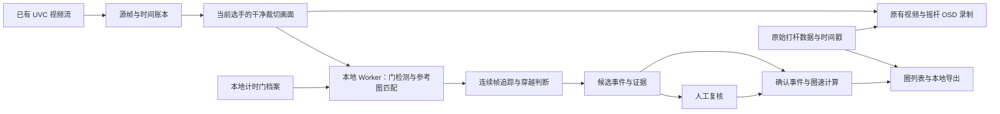

# 通用本地视觉计圈：产品与工程设计

日期：2026-09-05。状态：总体设计；阶段 A 的本地录像实验台与真实参考匹配基线已进入 0.5.0，0.6.0 增加单路实时观察与人工复核入口。设计基线：`origin/main@aa366e26ffa5f2fa6a5b7d6e9135cbfdd951f17e`，FPVHelper 0.4.1。当前操作和限制见[实验台使用说明](../vision-lab.md)与[实时计时说明](../live-vision.md)。下文的自动穿越、多路、校准与精度要求仍是后续目标。

## 1. 已确认的产品方向

面向所有用户提供自助配置：每个人导入自己的门照片，或从自己的 FPV 视频中截取门，建立可重复使用的本地计时门档案。首版选择一个起终点门，使用现有采集卡的机载 FPV 连续画面识别正向穿越，自动计算圈数和圈速。

用户不需要安装训练环境、标注成百上千张图片或训练自己的模型。我们交付通用识别能力，用户负责指定目标门和少量现场校准。产品入口应叫“设置计时门”，避免将上传参考图描述为“模型训练完成”。

产品第一版范围：一位当前选手、一个起终点门、本地实时实验计圈、本地录像复盘、人工修正、结果导出。沿用现有四格视频裁切与选手绑定，但先验收一条识别流；四位同时计时是后续性能与多选手数据模型扩展。当前已获准先实现下文阶段 A：本地录像分析与复核。

## 2. 找回的历史与当前代码

| 资产 | 当前已具备 | 仍需补齐 |
| --- | --- | --- |
| [视觉实验 runbook](../vision-lap-experiment.md) | 真值、数据隔离、固定验收阈值、人工复核规范 | 真实跨用户素材、模型和独立测试结果 |
| [过门状态机](../../lib/vision-gate-crossing.ts) | 方向、滞回、冷却、缺帧重置、时间插值 | 图像到可靠穿越信号的上游；FPV 专用时序判断 |
| [评估器](../../lib/vision-lap-evaluation.ts) 与 [CLI](../../scripts/evaluate-vision-laps.mts) | 真值/预测匹配、误报、重复、召回、P95、manifest 哈希绑定 | 将真实视频预测和标注转换成评估输入 |
| [视频工作区](../../lib/video-workspace.ts) | 一个源绑定四个裁切区域、选手标识，预留 `gateProfileId` | 真正的门档案、设置向导、运行时消费 |
| [OSD 合成器](../../lib/stick-video-compositor.ts) | 从已有视频流取裁切画面并烧入摇杆 | 帧时间账本、干净图像识别分支、可校准的视频对表 |
| [训练记录](../../lib/training-session.ts) | 原始打杆样本、人工 Marker、视频写盘回执 | 独立视觉事件与圈速派生结果、可追溯修正 |

历史 vision harness 提交 `a3ee139bf4a76a6c003c58a807ce031fb0ce4530` 的核心文件已进入本次基线；旧临时 worktree 路径失效不代表代码丢失。上述基线没有图像模型权重、真实视觉数据集或浏览器计圈入口；开发分支现新增 `/vision-lab` 与固定版本 DINOv2 参考特征匹配，仍没有通过验收的真实 FPV 数据集。评估器引用 `node:crypto`，继续作为离线工具，不能直接当作浏览器 Worker 推理模块。

## 3. 普通用户的完整流程

1. **接入画面**：打开已有采集卡，选择当前选手所属的裁切区域；展示实际输入分辨率、帧率和连续性检查结果。
2. **设置计时门**：上传照片或从当前画面/本地录像截取一帧。系统建议门框位置，用户点选目标并确认；支持补充不同角度和背面的参考图。保存自定义名字、方向和所属场地配置。
3. **检查可辨识性**：提示图片过小、遮挡严重、门洞不完整或相似目标过多。背景只能辅助匹配；更换赛道或移动门后重新校准，不能依赖旧背景作为永久身份。
4. **试跑校准**：用自己的短录像，或现场几次正常过门/擦过，显示候选时间点并让用户确认。“不确定”是正常结果；校准不达要求时仍可录像和手动复核。少量现场样本只建立档案和适配参数，不构成可靠性验收。
5. **开始计时**：第一次确认的正向穿越启动第 1 圈；下一次有效穿越结束该圈并启动下一圈。页面显示当前圈用时、上一圈、最快完整圈和已确认圈数。
6. **结束与复盘**：圈列表直接跳到过门附近的视频；支持确认、排除、补记和调整时间点。修改后重算受影响圈次并保存新版本，不覆盖原检测记录。

计时门档案可导出/导入，换电脑可复用照片和配置；视频源、裁切、图传链路或浏览器改变时应重新检查时间和性能。无需用户搜索特定示例图片；入口同时支持已有照片和“从我的画面选门”。

照片能建立目标参考，但一张照片本身无法证明飞机穿越了门。若赛道里有两个外观无法区分的同款门，仅靠照片不能可靠标识起终点：优先选择有明显差异的门或添加可见的独特图案，再用实际 FPV 画面验证。最短圈时、固定倒计时或背景相似度不能独立解决身份歧义。

## 4. 推荐的本地架构

首选现有网页内运行，不要求用户装 Python。采用轻量门检测/关键点模型、参考图匹配和时间序列判断；通过独立 Worker 使用 ONNX Runtime Web，优先 WebGPU，WASM 作为需重新测量性能的兼容路径。运行库提供这些执行能力，但是否支持具体模型和满足实时性能必须实测。[官方 WebGPU 文档](https://onnxruntime.ai/docs/tutorials/web/ep-webgpu.html)

所有图像识别在烧入本应用的摇杆叠层之前取图，避免叠层遮住门框。源视频自带的 Betaflight OSD 仍可能存在，要记录其位置并在模型/预处理与验证中处理；不能假设裁切后就是无 OSD 视频。显示、录制、识别共同借用现有输入，识别模块不得再次独占打开同一采集卡，也不得在停止识别时关闭别人的共享视频轨道。

| 运行方式 | 本次决定 | 后续触发条件 |
| --- | --- | --- |
| 网页 + 本地 Worker/WebGPU | 首版默认方案；复用现有视频、目录授权和训练台 | 在明确测试过的浏览器/机器组合开放实时模式 |
| 网页 + WASM | 兼容路径；慢设备可做本地录像分析 | 按实测决定实时、降低负载或只支持复盘，不默认为同等速度 |
| 桌面封装/本机原生服务 | 暂不增加安装负担，保留推理后端接口 | 四路持续负载或离线部署在浏览器上未达门槛时再验证 |

独立 Worker 直接承载推理；不要把 `ort.env.wasm.proxy` 当成 WebGPU 的 Worker 方案，官方注明该 proxy 不支持 WebGPU。WASM 多线程需要实际满足跨源隔离等条件，不能只设置线程数；任何响应头调整应单独验证现有网站功能。[官方运行参数](https://onnxruntime.ai/docs/tutorials/web/env-flags-and-session-options.html)

本地计算与断网启动分开验收：网页与模型首次加载需要可获得资源；若承诺断网使用，必须把应用、模型和运行库版本完整缓存或随本地安装包分发，验证清缓存、更新回滚和断网重启。没有验证前只写“视频本地分析、不上传”。

## 5. 通用模型与每个人的门档案

分成三个可独立评估的层：

- **通用找门**：我们训练/选择一个适合 FPV 视角的轻量模型，输出门框、门洞或关键点及可见性。数据覆盖不同形状、材质、颜色、镜头、距离和光线。普通目标检测权重不能未经验证就当作已具备 FPV 门识别能力。
- **识别指定门**：用户确认的参考图生成本地特征；结合门框纹理、颜色、形状与稳定追踪筛选目标。先评估轻量特征匹配基线，再决定是否需要单独的特征模型。相似度必须与“穿越置信度”分开。
- **判断穿越事件**：联合多帧关键点/门洞变化、接近趋势、光流和轨迹判断正常穿越、擦过、转身离开、反向经过及看不清。简单规则可以成为对照基线，真实误报决定是否加入小型时序分类器。

单图指定检测目标有现成研究基础，例如 OWL-ViT 的图像条件检测；这可作为离线对照实验，但不能把其单图检测能力当作 FPV 穿越或浏览器实时性能的证明。产品模型选型以我们的事件级和资源基准为准。[Google 官方实现](https://github.com/google-research/scenic/tree/main/scenic/projects/owl_vit)

用户新增门档案不会自动更新通用权重，也不会把照片上传训练。模型升级属于产品发布：记录训练数据版本、权重哈希、输入/输出约定、预处理和阈值；运行中固定版本，下一次训练再切换。发布前核验选定权重与素材是否允许产品分发。

“通用”意味着多个用户能独立配置、在声明支持的场景内通过测试，不意味着任意照片、任意门和任意图传都保证识别。新门类型无法可靠定位时，应提示不支持/需要补充参考并保留复盘入口。

## 6. FPV 过门判定与计圈规则

机载摄像机在运动，门框中心越过屏幕中的一条线并不等于飞机穿越门平面；门变大后消失也可能是擦边、转头、遮挡或丢帧。现有 `signedDistance` 状态机需要真实、方向明确的上游量，不能用 bbox 大小或中心位置随意拼出正负距离。

首版采用 FPV 专用状态序列：`搜索 → 稳定锁定 → 接近 → 穿越候选 → 确认/待复核 → 离开后重新准备`。穿越时间是序列中的估计事件时刻，确认可能稍晚到达；这两个时间分开存储。

| 观察情况 | 处理 |
| --- | --- |
| 目标稳定、接近与跨越证据连续、方向符合配置 | 产生一个自动确认事件；保留证据与模型版本 |
| 门变大但从侧面离开、接近后转身 | 不因目标消失直接计数；记录排除原因或待复核 |
| 门口徘徊、抖动或同一次穿越连续多帧触发 | 同一追踪片段只产生一个事件，离开后才重新准备；冷却仅作辅助 |
| 反向或方向不确定 | 反向不计入正向圈；无法判定方向时进入复核 |
| 画面冻结、缺帧超限、切换输入/裁切/目标 | 重置当前追踪、记录缺口；禁止跨缺口插值补造穿越 |
| 相似门身份冲突 | 不自动确认，要求复核/重新配置可辨识目标 |

现有方向/滞回/去重思想可复用。只有上游能够定义并验证几何有符号距离时才直接复用原插值接口；否则新增独立的时序事件实现，保留原模块和测试作为已有能力，不为了复用强行伪造距离。复用前还需补“有效观测间隔”测试：现有实现遇到低置信度样本仍更新时间戳，但保留旧的稳定侧样本，持续低置信度期间可能留下过旧的插值端点。新管线要按最后一次有效观测和候选寿命分别超时，不能只检查任意两次消息的间隔。

圈速计算以相邻有效起终点穿越为界：首次穿越只建立起点，不生成圈成绩；结束时未回到门的半圈不算完成圈。已观察到的疑似漏检、待复核事件或视频缺口会使相邻区间不完整，这些区间不直接纳入最快圈/平均圈。重新获得可信穿越后建立新的可靠起点；人工补记可恢复相关区间。若模型静默漏掉一次且没有留下任何异常证据，仅凭起终点事件无法判断间隔是否跨了两圈，仍需复盘/独立真值发现；异常圈时只能提示，不能保证排除所有漏计。界面区分“自动确认、人工确认、待复核、不完整”，自动确认不等同于人工真值。

最短圈时可作为异常筛查，但不替代目标身份与穿越证据；不得仅靠固定若干秒冷却决定下一圈。单一起终点门测量的是再次穿过该门的时间间隔，不能验证中途是否依次完成所有赛道门；这里的“完整圈”仅表示起止事件及视频证据区间完整。完整赛道路线验证属于后续多门能力。

## 7. 时间、录像和原始打杆数据的关联

计时必须使用参与判断的源视频帧时间，不能用推理结果返回时的 `Date.now()`。提取帧时建立不可变帧包：像素/帧句柄、`runId`、运行代次 `generation`、`sourceId`、`pilotChannelId`、门档案/模型/裁切版本、序号、`mediaTime`、主机接收单调时刻和可用的捕获元数据一起进入 Worker。请求、结果和存储均携带这些标识，只接受当前运行与代次完全匹配的结果，防止上一轮晚到结果混入下一轮。Worker 保留源帧身份，不把排队或推理耗时加到事件时间。

开始、停止、重连或改配置时推进代次；运行中门档案/模型/裁切锁定，确需更换时结束当前时间段并明确另起运行/分段，不只清除追踪变量。

`requestVideoFrameCallback` 的 `mediaTime` 表示媒体时间，但规范允许直播时为零；`captureTime` 对本地输入也并非必然可用。回调可能延后或漏过显示帧，采集卡链路的时间不能自动当作飞机相机的曝光时刻。[视频帧回调规范](https://wicg.github.io/video-rvfc/)

计时启用前先验证时间序列是否有效。若直播没有有效媒体时间，仅在验证过的链路上选用捕获时间，或单独标识为呈现/接收时间估计；运行中固定 `timestampSource` 和时间映射。没有满足要求的时间源时只能做候选复盘，不能用全零时间或切换时钟掩盖问题。四格画面共享采集卡输出帧，也不证明四架飞机的相机曝光同步。

设计规则：

- 圈速在同一段连续源媒体时钟内计算；保存事件时间区间/不确定性。30 fps 每帧约 33.3 ms、60 fps 约 16.7 ms，是采样间隔，不是系统精度保证。
- 分别记录事件时刻、候选生成时刻、确认时刻和推理延迟；界面可以稍晚确认，但不能改写事件到回包时刻。
- 记录 source 媒体时间、主机 `performance.now()`、Session 相对时间、录制输出时间之间的对应点、映射版本与残差。源重连/时间倒退建立新时间段，禁止跨段直接减时间。
- 当前 Session 明确 `synchronized: false`、`videoOffsetCalibrated: false`，录像是最新可用主机打杆样本叠层；现有回执尚不足以宣称帧级同步。设计要求增加对表机制，不把旧记录静默升级为已同步。
- 采集卡/图传的固定延迟在两次过门差值中可能抵消，变化的延迟会进入圈速误差；须对实际链路测量。单路源流时间可用于训练复盘，物理过门误差验收仍需独立、已对齐的真值。
- 记录输出保留已有 MP4 优先、兼容时 WebM、烧入摇杆 OSD 的行为。若未来视频烧入实时圈数，应标明实验/暂定结果；后续修正写新结果或重新导出视频，不能声称已烧入的视频被自动修改。

保留现有目标 100 Hz 原始遥控采样和 20 Hz 轨迹/油门显示节奏。视频模型按真实视频帧与计算预算运行，不能要求模型跟着 100 Hz 串口循环跑，也不能为识别速度改变原始数据采集配置。

## 8. 首版数据结构与文件保留

视觉计时独立于遥控数据有效性：有视频就可以建立 `VisionTimingRun`；连接打杆后可关联 `TrainingSession`，没有打杆时不能伪造 `ground_rc` 样本或降低原有 Session 有效性规则。已有录制主链继续按原规则运行，视觉入口不被串口按钮的可用状态错误阻塞。

| 对象 | 建议保留的核心信息 |
| --- | --- |
| `GateProfile` | ID/版本、门名、参考图与哈希、门洞/框标注、正反向参考、校准记录、模型兼容版本 |
| `VisionTimingRun` | ID、可空的 TrainingSession ID、选手通道/源/裁切快照、门档案版本、模型/阈值、媒体时钟分段、设备/输入实测参数 |
| `FrameLedger` | 源帧序号与时间、裁切版本、主机时刻、是否进入推理/丢弃原因、录像映射点；按块保存，不把整帧嵌入普通 JSON |
| `GateEvent` | 事件 ID、门 ID、方向、事件时间及区间、证据帧范围、参考图匹配与穿越评分、状态和原因、生成/确认时间 |
| `LapResult` | 起止事件 ID、持续时间、完整性、结果版本、自动/人工来源 |
| `ReviewAction` | 被修正事件 ID、确认/排除/补记/改时刻、理由、时间、旧结果引用；追加记录 |

视觉资料先使用独立 sidecar schema 与独立本地存储，避免破坏 TrainingSession v2 解析和现有 JSON 导入。示意导出：`session.json`、`session-sticks.mp4`、`timing-run-<id>.json`、`timing-run-<id>-laps.csv`，通过 ID 和 manifest 关联；具体文件名沿用产品的日期/ID规则。重复导出各结果快照应使用当前已采用的保留旧文件/分配 `-v2`、`-v3` 规则，不能只改扩展名或覆盖旧分析。

保留候选与确认事件、失败原因和人工修正，不能只存圈速汇总。用户随后可以分析最快/中位圈、稳定性、训练趋势，以及对齐后的过门前后打杆变化；单一起终点门不能据此得到每个门的分段时间、飞行速度或精确三维路线。

录像仍由用户选择保存。参考图片、事件和短证据按本地容量管理；需要建立训练素材时，单独提供用户主动开启的“保留识别原画片段”，从应用叠层之前保留过门前后窗口。默认不复制四路整段原片、不向服务器上传、也不把所有中间帧以 Base64 塞进 JSON。只有烧入 OSD 的旧录像也能做复盘，但要明确遮挡和对表限制。

## 9. 性能与故障隔离

首版工程目标是让当前单路在其真实 30/60 fps 源流上取得足够密集的有效观察，具体模型推理频率由验证选择；不预先承诺任意电脑达到固定 fps。基准同时打开原始遥控采集、OSD 录像和识别，测整条链路，而非只报告模型单次耗时。

- 每通道最多一个进行中的任务和一个最新待处理帧；过时帧及时释放。调度记录丢弃，队列不允许无限积压。
- 减少输入复制，按模型要求 letterbox/归一化并保留逆变换，识别坐标映射回真实裁切区域。1080p 四等分的每格只有约 960×540 可用像素，不能把每格当成独立 1080p。
- 必须统计输入 fps、有效推理 fps、最大连续观察间隔、预处理/推理/后处理 P50/P95、事件确认延迟、掉帧、录像完整性、RC 样本间隔和长期内存趋势。
- 性能不足时先缩减同时识别路数或停用自动确认、保留待复核；降低分辨率/频率后重新核验准确率。持续缺帧不能继续显示“正常计时”。
- Worker 崩溃、GPU device lost 或模型加载失败时，计时显示中断并标记当前区间；保持视频预览、原有录制和遥控采集可独立继续。
- 浏览器隐藏、系统休眠、采集卡重连以及两个标签页争用同一计时任务都要测试。使用本地运行互斥与明确的暂停状态，不将 Worker 当作后台永不暂停的保证。

后续四路：每个 `sourceId/pilotChannelId/runId` 独立追踪与计圈，调度公平且有负载上限。当前代码只为选中选手启动一条训练 Session/OSD 录像，不能宣称已具备四份同步遥控/录像档案；多路计时与多路录制应分别验收。

## 10. 研发顺序与通用性验收

| 步骤 | 交付 | 可进入下一步的证据 |
| --- | --- | --- |
| A. 本地录像实验台 | 参考图/门洞选择、逐帧标注、模型适配接口、候选与人工真值对比；接入真实轻量模型基线 | 可复现一段真实录像的预测、失败片段和评估结果；不拿假框演示充当识别完成 |
| B. 通用自助配置 | 门档案保存/导入、参考图匹配、现场校准、跨用户和新门型数据集 | 没参加开发的用户能独立设置；未见场地/门型结果单独报告 |
| C. 单路实时集成 | 源帧账本、Worker、过门/计圈、回放修正、JSON/CSV、故障隔离 | 与录制/打杆共同运行通过；实测性能与误差范围明确 |
| D. 四路与离线交付 | 多路调度、各选手独立 run、资源检查、完整离线资源管理 | 目标电脑四路持续负载、冷热启动、断网和故障恢复通过 |

研发起点应是 A：先在可反复播放的录像上验证“找对门并判断穿越”，同时建立可标注和评估的工具，再接实时按钮。实验台可以借助研发机器的本地工具训练/离线推理，普通用户交付仍按浏览器本地路线。

沿用已冻结的历史目标：独立 test 至少 300 次真值穿越，Recall ≥98%，误报与重复合计/真值 ≤1%，穿越误差 P95 ≤100 ms，所有低置信度事件可复核。这些是尚待达到的门槛，不是当前准确率；合成状态机测试和 UI 流程不能证明图像精度。

为面向所有用户，需要在旧 runbook 上增加以下评估设计：

1. 按整段 Session 隔离 train/validation/test，并增加“未见用户/场地/门型”的独立组；同一门在不同视频中的近似外观不能全部随机混入测试后宣称泛化。
2. 参考图与短校准片段属于每个测试场景的 setup；预先冻结允许的自助适配步骤，setup 与评分录像分离，不能用评分录像的人工真值反复调阈值。配置完成后留出的录像才进入最终评估。
3. 记录正常穿门、反向、擦过、转身、悬停、相似门、门中门、遮挡、逆光、运动模糊、图传花屏/冻结及裁切切换；负例按持续时间和次数报告，另报每小时误报，避免只测试成功穿越。
4. 保持旧的场地/光照/视频系统分层，同时报告门类型、是否未见门、设备档位与自助设置成功率。关键组证据不足则缩小支持范围，不能让总体平均掩盖失败。
5. FPV 画面无法直接观察飞行器参考点跨门平面时，标注估计区间和不确定性；物理时间精度采用已对齐的独立真值验证。只对视频可见代理事件评估时单独命名结果，不混称物理过门精度。
6. 验证持续运行、录制写盘失败、目录权限丢失、事件保存与导出恢复、重新分析不覆盖旧版本，以及人工修正后最快圈/平均圈的可追溯性。

现有评估器保持独立 CLI，通过适配器将冻结的自动管线预测转换成其 session/gate/direction/time 格式。盲测保留原始自动结果及待复核/拒绝记录；模型召回和 P95 门槛只评自动管线，不能把人工补记、修正时间后的结果作为模型预测通过验收。修正后的训练结果单独报告。新的不确定区间和人工复核日志保留在实验 run 中；评估器若扩展，单独升级 schema/测试。模糊真值排除规则在看预测前冻结，并报告排除比例。

## 11. 实施时的模块边界

以下为完整系统的模块职责；当前阶段 A 只实现其本地录像子集：

| 模块职责 | 与已有代码的连接 |
| --- | --- |
| 门档案与设置向导 | 消费现有 `gateProfileId`；档案修订时固定 run 使用的版本 |
| 视频帧分发与账本 | 复用 `getSourceStream()`、`videoCropPixelRect()`；与 OSD 录制共享输入 |
| 本地推理 Worker/后端接口 | 带版本的模型输入输出、时间与通道标识；可替换执行后端 |
| FPV 穿越与计圈纯逻辑 | 消费观测序列，输出事件和区间；不依赖 React 渲染周期 |
| 视觉 run 存储、回放与导出 | 独立事件仓库、追加修正、版本快照，可关联已有训练 Session |
| 离线基准与标注适配器 | 对接现有 `vision:evaluate` 和数据 manifest |

阶段 A 当前实现使用独立 Worker + WASM 运行真实模型，不依赖 WebGPU；按 2/5/10 fps 顺序取本地视频画面，相似目标接近只产生待复核候选。圈数由人工确认的相邻事件派生。浏览器 `currentTime` seek 位置记录为 `video_seek_position`，尚不是逐帧 PTS 或物理过门真值。0.6.0 增加每秒最多 2 个新帧的单路实时入口，独立保存 `host_presentation_estimate` 观察与可用的视频回调元数据，仍需人工复核。通用 FPV 门检测、方向判断、完整原始视频帧账本与跨用户精度验收继续留在后续阶段。已实现文件与验证口径见[实验台使用说明](../vision-lab.md)和[实时计时说明](../live-vision.md)。
