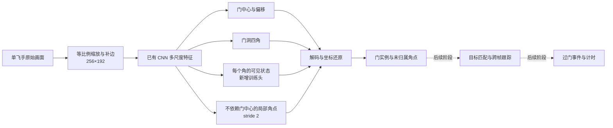

# 矩形竞速门检测模型 v0.1 设计

日期：2026-09-20。状态：设计提案，未训练新权重、未接入网页。范围已由 Long 确认：先做好常见矩形竞速门，再扩展拱门与圆门。

本设计位于 FPVHelper 独立分支 `codex/gate-detector-design`，基于 `main@a7ac87dbdae400803e46dc22c8d3548f2b05cf61`。本仓库公开设计与现有 FPVHelper 实现，不包含其他私有项目的源码、权重或训练数据。

## 1. 第一版交付什么

输入一位飞手的一帧 FPV 画面，输出画面内矩形门的检测结果、门洞内角与可见性，以及尚不能归属到某扇门的局部角点。录像逐帧复盘先验收，之后接入单路实时视频。

模型回答“哪里有门、哪些角点有证据”。目标门身份、跨帧跟踪、正反向穿越与圈速由下游模块负责。检测分数不叫“过门概率”；门从画面消失不直接触发计圈。

首版接受有透视、滚转、部分遮挡、近距离出画的矩形门。拱门、圆门、旗杆不作为本版正类；记录为范围外目标，不能伪装成四角完整的矩形门。底横杆缺失的门可以有部分有效角点，不能把地面纹理补成真实横杆。

## 2. 可复现基线与研究状态

公开可复现的当前基线是 FPVHelper 的 `Xenova/dinov2-small` 参考特征匹配，输入 224×224。用户上传门照片不会产生训练更新；模型与来源信息见 [`lib/vision-model.ts`](../../lib/vision-model.ts)。

本次另做过一套外部门检测器的本机源码与合成帧检查，用于评估中心点与角点结构。它不属于本公开仓库的可下载资产，因此不将该检查称为本仓库新模型的验证。私有来源标识、权重哈希、内部配置与详细运行记录留在本机。

下文 CNN 是待实现、训练和评估的候选设计。门检测准确率、Windows CUDA、GPU 耗时、ONNX 数值一致性、浏览器兼容性与录制并行性能均尚未验收。本仓库尚未发布可复现的专用门检测 CNN 权重。

## 3. 推荐结构：复用基线，再增加可见性与局部角点



### 两个可比较候选

- **B0 基线**：先运行本仓库已有的 DINOv2 参考匹配，冻结参数，在同一组已标注真实录像上测量门检出、误检和延迟。DINOv2 不输出四角，角点指标标为不适用；另选可公开获取或明确获授权的角点检测器作为几何对照，不能编造 DINOv2 角点成绩。
- **G1 候选**：采用可训练的 CNN 编码器和多尺度解码器，提供门中心、四角、每角可见性与中心无关角点输出。实现时记录初始化来源及权重授权范围；新增头需要训练，不能把随机初始输出当作可用检测。

G1 如采用已获授权的预训练初始化，网络宽度和层级须与权重兼容。只有实测超出浏览器预算时，才单独比较降低宽度或蒸馏后的模型；修改结构后不能声称原权重仍可完整加载。

| 分支 | 建议输出 | 用途 |
| --- | --- | --- |
| 门中心 | stride 4 的单类中心热图与二维亚像素偏移 | 枚举门实例；旗杆不作为本版门的正类 |
| 门内角 | 每实例四个二维角点 | 门洞几何与下游跟踪；保留原顺序的适配映射 |
| 角点状态 | 每角 visible / occluded / out_of_frame / not_present / unknown | 真实可见证据与推测分开；没有可靠位置的角点坐标为 null |
| 局部角点 | stride 2 热图与二维偏移 | 门中心出画时仍保留局部证据；自身不输出目标门身份 |
| 分割辅助 | 训练期间的门框/背景监督 | 仅使用有对应标注的样本；真实录像无分割标注时屏蔽该损失 |

基于合成相机和门尺寸学习的距离、或根据印刷外观判断的正反面，都不能直接当作真实距离或飞行穿越方向。第一版检测接口不输出这些物理结论。裁剪训练辅助输出时须核验共享权重和数值一致性。

局部角点头需要 stride 2 特征。导出时须保留提供局部角点的解码路径，再单独裁掉分割输出。不能把整个高分辨率解码分支一并移除后，仍宣称支持该角点输出。

### 已知结构限制

单实例中心热图的同一格不能完整表示两个同心门。多门叠套场景必须保留全部真值并统计漏检，不能因模型限制删除标注。若关键目标在这类场景持续丢失，G1 不通过验收，再比较能表示同格多实例的检测头。

中心出画后，无归属的角点只进入 `unassignedCorners`。单帧不足以把它们可靠拼成一扇门；后续跟踪可结合前帧实例匹配，失败时返回未知，不拼凑虚假的完整门洞。

## 4. 输入、坐标和输出契约

- 取当前飞手裁切后的原始画面，位于本应用摇杆叠层合成之前；源图传自带 OSD 仍作为实际数据条件记录。
- 初始输入固定 256×192、RGB、uint8 NHWC。保持比例并补边，不把 16:9 或其他比例直接拉伸为 4:3；训练、Python 推理和浏览器使用同一预处理定义。
- 保留缩放比例、补边、原裁切和旋转映射。输出坐标先逆映射回当前飞手裁切画面，再供显示和复核使用。
- 第一版不默认使用镜像画面；镜像、滚转增强必须同步变换角点与状态。四角按模型原顺序保存；跨帧对齐须处理循环置换、视角反转，不能用“画面左上角”永久代表某个物理角。
- 不可见角点允许网络内部回归候选，但公开结果中必须携带状态；无可验证位置时返回 null。范围外推断不得被钳制到边缘后冒充实测角点。
- 只有完整、有效的四边形才提供 `apertureQuad` 及由其计算的 `apertureBounds`。部分结果不输出伪造的完整框。
- 携带 `runId/generation`、输入/飞手/裁切标识、帧序号、媒体时间、主机观察时间、时间源类型、模型与预处理版本。模型原样返回帧身份，不用推理结束时间替换帧时间。

示意接口（尚未接入现有 schema）：

```ts
type CornerState = "visible" | "occluded" | "out_of_frame" | "not_present" | "unknown";
type Point = { x: number; y: number }; // 当前飞手裁切画面的归一化坐标
type Corner = { point: Point | null; score: number; state: CornerState };
type Quad = [Point, Point, Point, Point];

interface RectGateObservation {
  detectionId: string; // 仅此帧内唯一；不是永久门 ID
  class: "rectangular_gate";
  score: number; // 检测分数，未校准为概率
  corners: [Corner, Corner, Corner, Corner];
  apertureQuad: Quad | null;
  apertureBounds: { x: number; y: number; width: number; height: number } | null;
}

interface RectGateFrameResult {
  frame: {
    runId: string; generation: number; sourceId: string; pilotChannelId: string;
    cropRevision: string; sequence: number;
    mediaTimeMs: number | null; hostObservedAtMs: number;
    timestampSource: "media" | "host_presentation_estimate";
  };
  model: { id: string; weightsSha256: string; preprocessingVersion: string };
  detections: RectGateObservation[];
  unassignedCorners: Array<{ point: Point; score: number }>;
  inferenceMs: number;
}
```

当前 FPVHelper 的 `VisionModelManifest`、Worker 和结果校验绑定 DINOv2 局部特征，不是通用模型插槽。实现时新增有版本的矩形门协议/适配器；不能把 CNN 的检测分数写入现有 `similarity` 字段，也不修改旧计时记录里的模型来源。保留旧记录恢复与现有参考匹配作为对照。

## 5. 数据与标注

第一批标注预算建议为约 3,000–5,000 张有代表性的真实关键帧，另保留连续负例录像；这是启动规模，不保证足以泛化。优先覆盖接近、临门和刚过门片段，避免把大量相邻重复帧当作独立覆盖。

正例分层：不同矩形长宽比、尺寸、颜色/纹理，远小门、近大门、倾斜、滚转、背面、多人场景、多门叠套、门中心出画、OSD 遮挡、逆光、暗光、运动模糊和图传噪声。按模拟图传/不同数字图传分别记录，不能把某一种合成摄像头的训练成绩当作这些链路已通过。

负例分层：窗框、广告牌、护栏、方形装饰、阴影、旗杆、拱门、圆门以及无门飞行段。擦门和反向穿门中的真实门仍是检测正例，只有将来的“有效穿越事件”标注不同；避免把检测和过门任务的标签混为一谈。

每张标注包含：录像哈希、帧身份、画面内实例 ID、可判定的门洞内角与状态、是否范围外、模糊/遮挡条件。可见内角优先标在门洞与实体门框交界，不混用门框外角。没有底横杆、底角接地点不清晰时，不凭直觉补齐；不确定区屏蔽相应损失。真值位置来自人工复核或独立仿真真值，不由待评估模型自动确认。

数据按完整录像、同一采集会话及近重复片段成组划分 train/validation/test；同一次飞行的多份录像不能跨组。额外保留未见场地或未见门外观的测试层。建议初始按组 70/15/15 划分，但场景独立和覆盖优先于数量比例；所有增强图随原视频所属组走。

第一批双人独立复核至少 20% 的标注，保留分歧与裁决。检查门洞内/外角、底角、滚转顺序和局部门状态是否一致，再扩大数据量。

## 6. Windows/Python 训练路线

1. 使用公开可复现的 DINOv2 权重做 B0 真实录像基线，并选择可复现的角点对照；记录每项指标的适用范围。
2. 实现真实图像与标签 Dataset、统一预处理和损失掩码；如使用仿真生成器，将其作为独立数据源，不能把仿真输入冒充真实 DVR 标注。
3. G1 先训练新增可见性/局部角点头，再比较小学习率联合微调；保留一部分仿真样本，混合比例仅用 validation 选择并记录。
4. 中心/局部热图采用 focal loss；偏移、角点采用掩码 L1/Smooth-L1；可见状态采用掩码分类损失。真实样本缺少距离、印刷朝向或分割真值时，不使用该项监督。循环角点对齐不能跨不同实例匹配。
5. 固定随机种子、源权重哈希、数据清单、预处理、每项损失权重、优化器、批量和停止规则；用验证结果选候选后冻结，再打开独立 test。

本仓库后续需要独立的门检测训练入口；飞行策略的强化学习训练不属于本次任务。

优先评估 Windows + NVIDIA GPU 的 WSL2/Linux 环境；Windows 原生兼容性也可单独验证。显卡、显存、驱动和 CUDA 能力尚未确认，因此没有批准批量、混合精度或训练时长。不能把大批量或 CUDA BF16 当作所有电脑通用的配置，需先检查设备能力与显存。

正式长训练前提供可打印的完整配置和短时训练/保存/恢复检查。训练入口应支持配置预览，完整参数确认后才启动长跑；本文没有提供已经存在的训练 CLI。

## 7. 如何判断值得接入

以下是待冻结的内部候选门槛提案，不是已有成绩，也不替代 [过门计时验收](../vision-lap-experiment.md)。

| 维度 | 测量与候选规则 |
| --- | --- |
| 完整门检测 | 报告 AP50/AP50:95、固定阈值下 precision/recall；建议内部起点 precision≥95%、recall≥95%，且各关键场景单列结果与样本量 |
| 可见角点 | 一对一匹配到同一真值实例后，报告误差中位数/P95和≤门洞对角线 5% 的比例；建议后者≥90%；小门同时报告原始像素误差 |
| 部分门 | 角点 precision/recall、连续可见期间无证据的最长间隔、错误归属次数；中心出画场景单列，不排除失败样本 |
| 无门误检 | 在连续负例录像中报告逐帧误检，以及按冻结关联规则合并后的虚假目标段/分钟；不能用几个截帧推算小时误报 |
| 目标身份 | 门检测阶段不声称已确认起终点身份；相似门、多门叠套的错误匹配由后续模块独立评估 |
| 速度与录制影响 | 在指定设备/浏览器上测预处理、推理、解码和端到端 P50/P95、实际吞吐、跳帧与录像/RC 缺口；30 FPS 路径的候选计算预算为每帧33.3ms，当前无达标证据 |
| 模型替换决策 | 同一独立素材同时测 B0、G1 和当前 DINOv2；精度、覆盖和端到端成本一起比较，不能只因结构更新就替换 |

上述完整门框指标仅用于有可核验门洞四边形的实例。所有部分门仍进入独立分层统计，不能因无法计算完整框而从总体覆盖报告消失。样本量不足的场景返回“证据不足”，不汇成“全面通过”。

时间误差、漏计和重复计数属于之后的过门阶段。现有目标为独立 test 至少300次真值穿越、召回≥98%、误报+重复≤1%、时间误差P95≤100ms；本检测模型达到内部门槛不等于这些目标已达成。

## 8. 导出与内部网页实验

先用 FP32 导出固定形状、batch=1 的 ONNX，以 opset17 作为待验证起点。ONNX 结构检查不等于数值验证；验收需把同一组真实/合成帧在 PyTorch、ONNX Runtime CPU、浏览器 WebGPU 中的原始张量及解码结果逐项比较。FP16 或 INT8 是独立精度/速度候选，不能在 FP32 成绩上直接更换。

首轮以原始浮点张量 `atol=1e-4, rtol=1e-3` 作为差异调查起点，同时比较解码框、角点和阈值附近的检出变化；容差是否合适需据实际算子确认，调整要记录原因，不能靠放宽容差掩盖检测变化。

浏览器用独立 Worker 借用现有视频，只保留最新帧、一次一个推理。停止/切换/迟到结果沿用 runId/generation 隔离；模型错误不能中止录像。WASM 可作为另行测量的兼容路径，不能保证与 WebGPU 同速。

2026-09-20 已回读 `helper.longxl.com` 和 `race.fpvsuperapp.com` 指向同一生产构建。G1 网页实验发布前，先明确独立分支构建与 helper 域名的部署映射，回读两个域的版本；本设计不修改当前域名绑定或生产代码。

## 9. 已完成与下一步

已完成：当前 FPVHelper 源码核对、本方案的结构、数据、接口和验收设计。外部研究检查不作为本仓库模型验收。

下一步最小实验：获取一组可用真实录像 → 标注完整门与临门部分角点 → B0 与可复现角点对照的离线评测 → 再确定 G1 改进优先级。Windows 配置与真实数据未核实前，不预估训练小时数或发布识别准确率。

参考：[当前模型契约](../../lib/vision-model.ts)、[参考匹配计时逻辑](../../lib/vision-timing.ts)、[既有整体方案](local-vision-timing.md)、[CenterNet 原始论文](https://arxiv.org/abs/1904.07850)、[ONNX Runtime WebGPU](https://onnxruntime.ai/docs/tutorials/web/ep-webgpu.html)、[CUDA on WSL](https://docs.nvidia.com/cuda/wsl-user-guide/index.html)。
